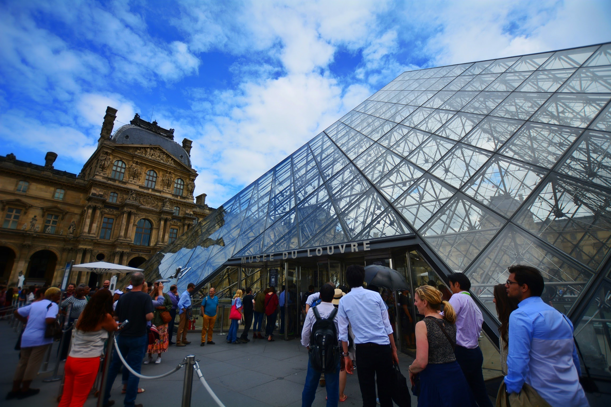
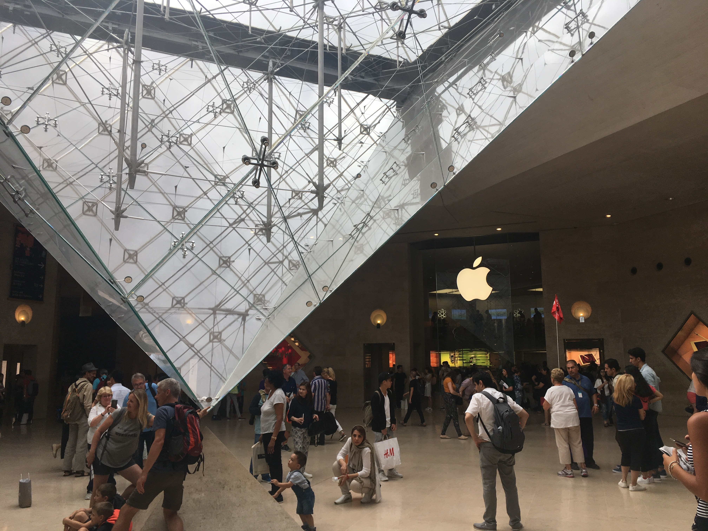
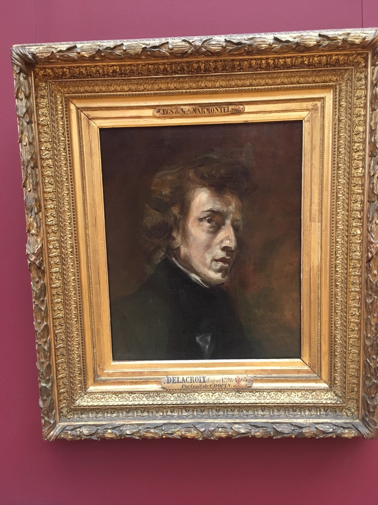
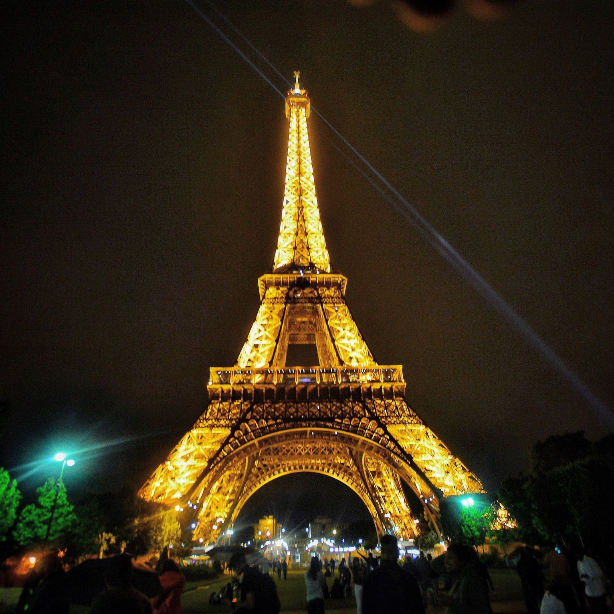
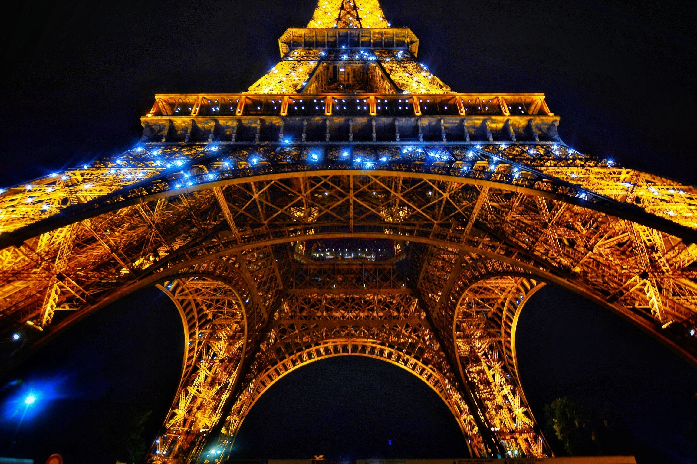
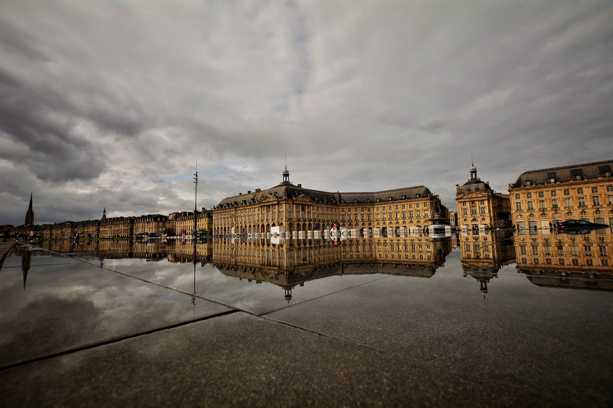
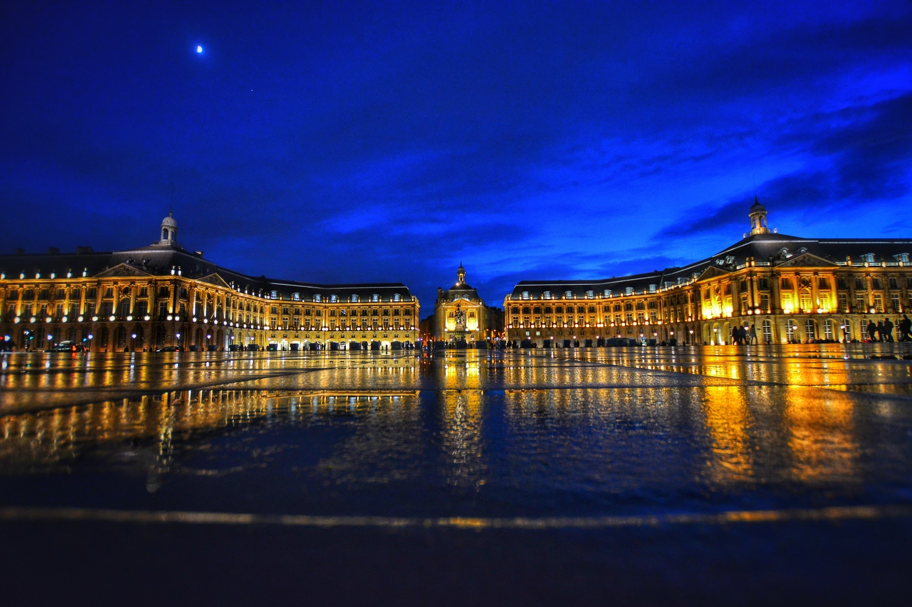
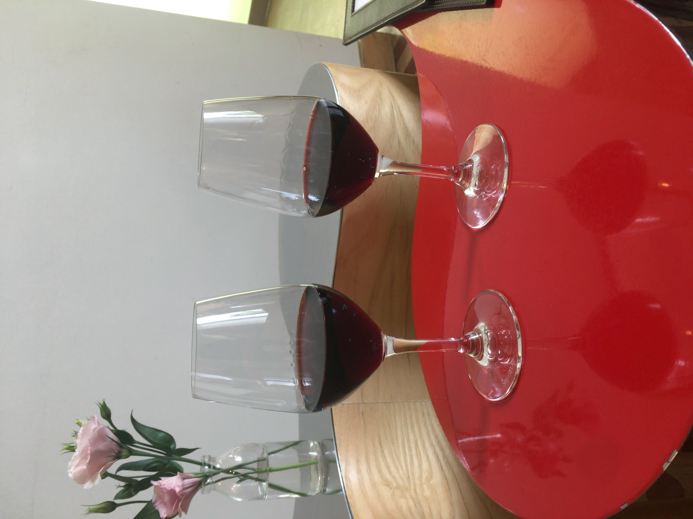
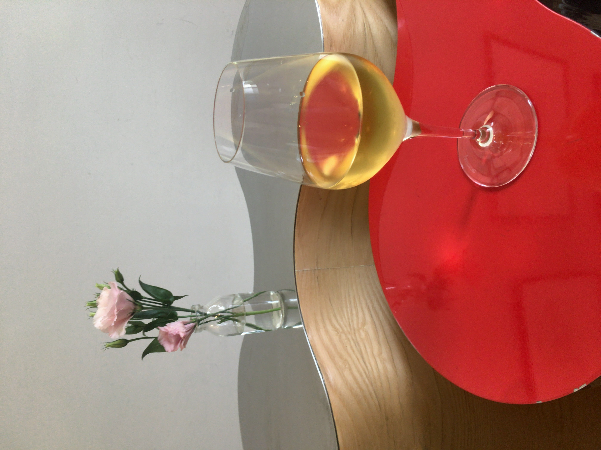

こんにちは

あき[@Akii0205](https://twitter.com/Akii0205)です

オランダ留学の夏休み、2 ヶ月間を利用して旅行してきました

最初の国はフランスです

フランスではパリ、ボルドー、トゥールーズ、リヨン、ストラスブールを訪れ、今回はパリとボルドーについて書きます

# 花の都パリ

まず自分が留学していたオランダのユトレヒトからパリまでは、 宿泊費を節約するために、[Flixbus](https://global.flixbus.com/) の夜行バスで移動

料金は29 ユーロ

実はパリに行くまで、パリは怖いところ、という印象があった

というのも、フランスに行ったことのある友だちが、地下鉄メトロで移動中にもろにバッグに手を突っ込んできて財布をすられそうになった、とか、

他の友人からも「パリは危ない、治安が悪い」だとかいろいろいわれていたので、結構ビクビクしながら行ったけど、普通に気をつけてれば大丈夫かな

治安悪そうなところに行かないようにだったり、スリにしっかり注意するなど、意識していれば問題なかった

## パリの宿

パリでは[ドリームハウス](http://dreamparis2000.com/)という激安日本人宿に宿泊

パリ郊外の宿で、世界一周中の旅人、夏休みで旅行中の学生、お仕事でパリに来た、などと様々な人が宿泊してました

この宿のすばらしいところは、なんといっても値段の安さ

朝夜ご飯付きで一泊 20 ユーロ(2017 年時)

中心の近くで泊まれば移動が楽かもだけど、この宿まで地下鉄で一本乗るだけだし、10 枚券を買えば一回 1.5 ユーロなので、時間があって節約したい方にはオススメ

## ルーブル美術館

ルーブル美術館の紹介でよく映るピラミッド

ルーブル美術館は、EU 圏に留学中の 25 歳以下の学生はタダで入れる

また、障害者手帳持ってる人は、チケット売り場に行かずとも、入り口で手帳を見せることで本人と同伴者までタダで入れる

フランスは結構障害者や学生に優しい国なのかな？

ダヴィンチコードで出てくる有名なシーンに使われた逆さ型のピラミッド

全部ゆっくり見て回ろうと思うと、一日中板としても回りきれないほど内部は本当に広い

 

ピアノやっており、ショパンが好きなのでショパンの顔をひと目見に

 

日中はルーブル美術館でゆっくりしていたので、夜にエッフェル塔を見に行くことに

## エッフェル塔

エッフェル塔は日没後、毎時 0 分より 5 分間だけ光る特別なライトアップは「シャンパンフラッシュ」と呼ばれる

東京タワーと比較されることが多いエッフェル塔ですが、下から見た光景が違いを感じられるといわれてるそう

 
 

そんな感じで、次はボルドーへ移動することに

# ボルドー（Bordeaux）

パリからボルドーまでは [Ouibus](https://fr.ouibus.com/) を使って移動

青いカラーが特徴のバス会社です

 
19 ユーロでした

(2020 年時点で調べてみたら、OuiBus は BlaBlaCar に買収されたそう[元記事](https://thebridge.jp/2018/11/blablacar-buys-french-bus-service-raises-114-million)

シェアリングサービスがバス会社を買収するとは思いもよらなかったなー)

8 時間の移動時間なのでしんどいかなと思ったけど、割と大丈夫でした

途中 PA でトイレ休憩したり、Wi-Fi が車内にあったりと、結構快適に過ごせた

## ボルドーについて

ボルドーは最近観光熱が上がってきているらしい

ニューヨークタイムマガジンの観光値世界ランキングでも 2 位にランクインしており、理由としては最近長年にわたる大規模構造改革を進めてきており、新たな都市として成長を遂げたからっぽい

また、ヨーロッパで唯一(?)バリアフリーが進んでおり、足の悪い方に優しいという認証を受けている都市であり、段差がなく市内のどこへでもアクセスしやすいように都市計画されているそう

だから街のどこ行っても、確かに段差が少ない

## ボルドーの宿

ボルドーの宿は Airbnb 使った

本当は[Auberge Jeunesse Bordeaux](https://www.auberge-jeunesse-bordeaux.com/?lang=en) に泊まる予定だったけど、予約できておらず、急遽 Airbnb で宿を確保することに

泊まった宿はこのホステルの近くで、駅まで歩いて 5 分かからない好立地（と思ったけど、ボルドー駅自体が街の中心から離れているので、そこまで好立地でもなかった）

ホストの方も優しそうな感じで、朝はコーヒーを入れてくれた（コーヒー好きじゃないけど笑）

Airbnb 宿の詳細はこちら

[Chamre proche centre](https://www.airbnb.jp/rooms/34642787?source_impression_id=p3_1604418422_H9jtoK0YKiqFI7xZ&guests=1&adults=1)

値段は大体20 ユーロぐらいだったけど、今見たら 25 ユーロぐらいになってる

## 水の鏡（Le Miroir d'eau）

ボルドーの観光名所として知られる水の鏡(Miroir d'eau)

ミロワール・ドーと読む

2006 年に設置されて以来、一瞬にして人気を博し、ボルドーの定番観光スポットとなったそう

他のフランスの地方都市もこぞって真似し、同じような水の鏡を設置しているみたい

昼と夜では違った顔を見せ、ライトアップが反射して綺麗じゃー

## グランテアトル（ボルドー大劇場）

ボルドーの中心より少し北にあるボルドー大劇場（Grand Théâtre）

この劇場は 18 世紀に作られた劇場の中では、世界で最も美しいと知られてるそう

パリのオペラ・ガルニエを作ったシャルル・ガルニエはこの大劇場を見て触発されたらしい

夜はライトアップが綺麗に映える

## [Le Bar à Vin](https://baravin.bordeaux.com/en/)

お昼からワイン飲み

英語も通じたので、甘いワインをくださいと言ったら、貴腐ワイン並に甘くて美味しい白ワインが出てきた

値段は一杯 2~8 ユーロぐらい

写真の通り、結構な量でサーブされるので、満足

ボルドー各地の美味しいワイン飲むならこのお店でハズレはないんじゃないかな

 
 

ボルドー過ごしやすそうな街だなーって思いました

 
 

次はポルトガルへ移動します

ではまた
