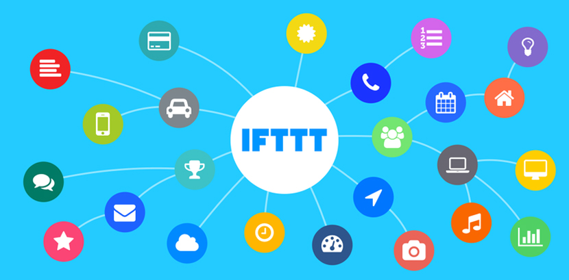

こんにちは

Aki です

今回は 2020/9/6(日)に、超福祉展 2020 にて行われた、Oticon 社とのトークセッションに参加した話をしたいなと思います

トークセッションはオンライン配信でアーカイブされており、[こちら](http://peopledesign.or.jp/fukushi/symposium/373/)に動画があります。

まず、登壇人物は

1. Oticon 社の社長 **木下　聡**さん
2. Oticon 社のオーティコン補聴器 アドバンスド・オーディオロジー・センター トレーナーの**川田　夏希**さん(肩書長い笑)
3. モデルの**我妻　ゆりか**さん
4. そして自分

の４人

Oticon 社の二人と、ゲストである自分と我妻さんの二人が、補聴器ユーザとして、幼少期から今に至るまで、どのように聴覚障害と補聴器について向き合ってきたのか、ということについてトークセッションをします

まぁそこらへんは動画で見たほうがわかりやすいかなと思うので、割愛(雑)

このブログで書きたいのは、IFTTT という、インターネットに繋がる２つのものを連携させて、何かしらのアクションを起こすというツールについてです

# IFTTT とは

If this then that の頭文字をとったもので、

# 編集中
