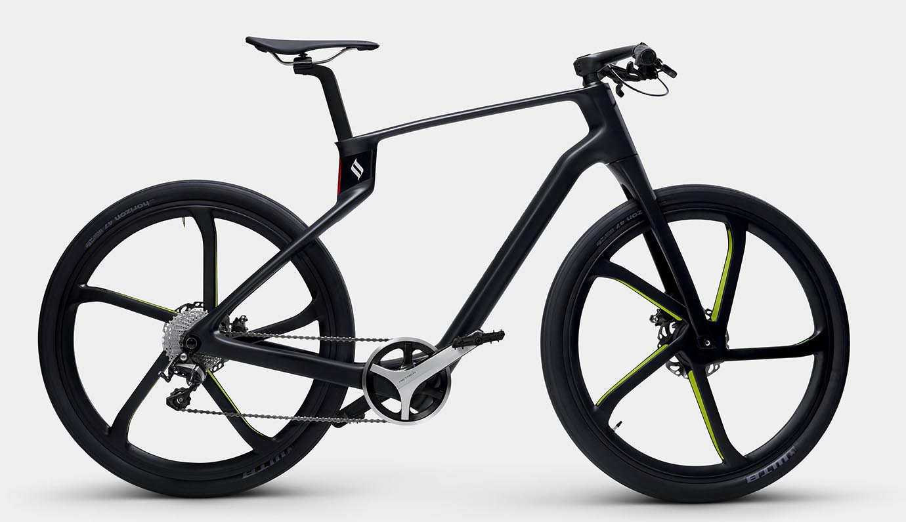

早速だけど、以下のバイクをクラファン(クラウドファンディング)で見つけた瞬間、即決した

# [SuperStrata](https://www.indiegogo.com/projects/superstrata-bike/x/16219158)

買った理由は以下の通り

1. **軽い**
2. 見た目がかっこいい
3. カーボンでできているのに安い
4. 3D プリンタで個々に合わせたサイズに作ってくれる

## 軽い

これ一番重要で、決め手になった

都内の移動は 5km 県内ならほとんど自転車なんだけど、結構アップダウンが多くて、しんどいから、もともと電動自転車欲しいなと思っていた

でも電動自転車ってどれも重くて、今までやっていた、自転車を持ち上げて階段をのぼる、なんてことはできなくなるのがちょっとしんどかったのね

なので、それができるようなぐらいの軽さの自転車があったらいいなと思っていた

この SuperStrata はバッテリー入ってる電動自転車でも 12~13 キロぐらいしかないらしい

普通の電動自転車は 20 キロ〜ぐらいあるんじゃないかな

バッテリーの大きさで航続距離とか変わるけど、ぶっちゃけそんなガチで乗らないし、50km もアシストしてくれれば十分だと思っている

この SuperStrata は航続距離が 100km 弱なので、十分すぎる

## 見た目がかっこいい

ふつーにかっこよくないですか？

ひと目、いやよく見たとしても、どこにバッテリーが内蔵されているのかわからない見た目もすごく惹かれた

## カーボンでできているのに安い

自分はあまり自転車の相場とかはわからないけど、普通カーボンフレームの自転車を買おうと思ったら平気で 2,30 万以上はするらしい

軽いからサイクリストにはいいかもしれないけど、そんなに耐久性はないというのが玉に瑕

でもこれは後述する、3D プリンタで作るので、通常組み合わせて作るパターンとは違って、ユニボディという、最初から出来上がった状態で作られるので、かなり丈夫らしい

また、前後のブレーキ両方ともディスクブレーキになってる

このクオリティで、しかも電動自転車ということから、他の自転車見ても 3~50 万ぐらいはしてもおかしくないと感じてるので、クラファンで安い今のうちに買ったほうがいいなと思って、即決した

## 3D プリンタで個々に合わせたサイズに作ってくれる

前述したように、3D プリンタを使って作るらしいんだけど、事前に身長や体重、ハンドルの種類やその他のオプションによって、その人に最適な SuperStrata を作ってくれる

以下のサイトでその調整をするみたいだけど、まだクラファン終わってないので、すべての項目は 10 月末に完成予定らしい。

**[Superstrata Studio](https://superstrata.bike/studio?r=slt-eml-bck-a2e0&utm_source=sailthru&utm_medium=email&utm_campaign=bck-09232020update&utm_term=)**

自転車って普通出来合いのものを買ってそのまま乗るから、調整するとしてもサドルの高さや、ハンドル調整ぐらい？だと思うんだけど、いちからすべて調整してくれたらさぞ快適だろうなと思って、それも決め手になった

実際高いやつ買うと、お店でそういう調整を結構するらしいし（前傾姿勢になったとき感じとか）

実際に届くのは 12 月中らしいので、12 月が待ち遠しい

日本語のサイトはこちら

[SuperStrata.bike](https://www.superstrata.bike/)
