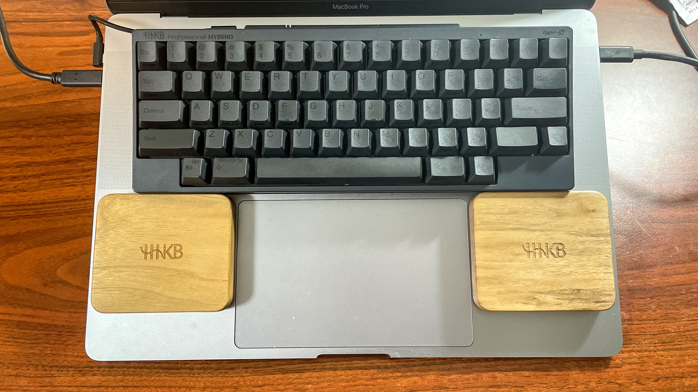
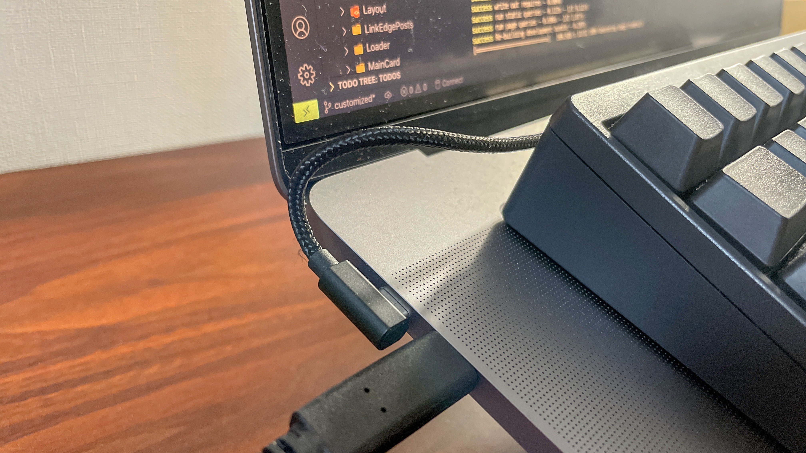

こんにちは

あき[@Akii0205](https://twitter.com/Akii0205)です

HHKB を 12 月頭に購入し、約 1 ヶ月以上経ったので使い勝手を軽くレビューしてみようかなと思う

まず、購入したのはこちらのモデル

[hhkb professional hybrid type s 英語 墨](https://shopping.yahoo.co.jp/search?first=1&ss_first=1&ts=1611392289&mcr=2d719458c78f3641416a15ac1b073439&tab_ex=commerce&sretry=1&area=13&astk=&aq=&oq=&p=hhkb+professional+hybrid+type+s+%E8%8B%B1%E8%AA%9E+%E5%A2%A8&sc_i=shp_pc_search_searchBox_2)

自分はずっと US 配列を使ってきたので英語キーボードを買った

なんでこんな 3 万超えるようなキーボードを買おうと思ったのかというと、

---

1. エンジニアだから毎日パソコンと向き合ってるし、1 日のほとんどはキーボード触ってる
2. 毎日使うものはできるだけいいものがいい、というポリシー
3. 好奇心から（キーボードに 3 万の価値があると思わせるようなものって何？っていう）

---

という理由から買った

それでも最初は「たかがキーボードに 3 万はないだろ…」という気持ちがあったのが正直なところで、実際これを買うまで半年近く悩んでいた

それでも、実際に 1 ヶ月使ってみて、2020 年のベストバイの一つに入るんじゃないかなと思っている

理由は大きく 3 つ

---

1. Touch Bar の画面を見ずに諸々の操作ができるから
2. 打鍵感最高
3. 備え付けのキーボードよりも指の移動が少なく、キーボードを見る時間が明らかに減ったと感じる

---

# Touch Bar の画面を見ずに諸々の操作ができるから

まず、自分の PC に限った話かもしれないが、自分の MacBook Pro は、実は以前から調子が悪くて、Touch Bar が映らない笑

起動直後は問題ないのだが、おそらく使用しているどれかのソフトウェアのせいで、Touch Bar が映らなくなっていると思っている

もうそのソフトウェアを探し出すのも面倒くさいし、以前から Touch Bar は嫌いだったので、常日頃からなんとか Touch Bar の代替案がないものかと思っていた

（ちなみに次の MacBook Pro はタッチバーないモデルが出るらしいので、楽しみにしている）

[新型 MacBook Pro は MagSafe 復活、Touch Bar 廃止、複数種類の外部ポートを搭載か](https://gori.me/macbookpro/132419)

そのため、以前の MacBook のように、キーボードを見ずに操作できる、つまり Fn キー的に操作したいと思っていたので、こちらのキーボードはその要件を満たす

キーボードを見ずに音量調節や音楽の再生、停止、画面の調光調節ができると、やはり Touch Bar の使い勝手は非常に悪かったと改めて実感する

# 打鍵感最高

以前は Windows PC に備え付けのキーボードによくある叩く時に高さがあるキーボードのタイプが苦手で、Macbook の薄いキーボードが好きだったんだが、

今ではこの HHKB キーボードの「静電容量無接点方式」というやつに魅了され、スコスコしながらキーボードを叩くのが気持ち良いと思うようになってしまった

人って好み変わるのね笑

# 備え付けのキーボードよりも指の移動が少なく、キーボードを見る時間が明らかに減ったと感じる

HHKB の英語配列キーボードの特徴として、カーソルキーがないことが挙げられる（日本語配列の場合は普通にカーソルキーがある）

Enter キーの右下にあるのが Fn キーで、それを押しながら、以下のキーの組み合わせでカーソルキーの役目を果たす

|     | カーソルキーの操作方法            |
| --- | --------------------------------- |
| ↑   | Fn + [ (角括弧)                   |
| ↓   | Fn + / (スラッシュ)               |
| ←   | Fn + ; (セミコロン)               |
| →   | Fn + ' (シングルクォーテーション) |

最初はこの HHKB 独特のキー配列により、慣れるのに３日ぐらい、普通に使えるようになるまで１週間ぐらいかかった

でも、慣れてしまった今は、他の普通のキーボードを使ってみると、なんと無駄の多いことか！と思ってしまうぐらいに HHKB にハマってしまった

# 最後に

HHKB の周辺機器として、以下二つを購入した

非常に Fit するので、おすすめ

1. usb TYPE-C ケーブル

長さがちょうどよく、MacBook Pro に乗せて使う尊師スタイルの方にはこのケーブルがいいじゃないかと思う

見た目もそんなにチープな感じではないので、コスパが良い

[アイネックス USB Type-C ホストケーブル C - C 両端 L 型 10cm U20CC-LL01T](https://www.amazon.co.jp/gp/product/B081QL9QF3/ref=ppx_yo_dt_b_asin_title_o05_s00?ie=UTF8&psc=1)

2. パームレスト

最初の半月はこれなしでもよかったのだが、以前はタオルを下に敷いてキーボードを叩いていたので、パームレストがほしいと思い、調べてみたら、

なんと、尊師スタイルのための、セパレート型のパームレストがこの Type-S の発売に伴って同時に発売されていたというではないか

見た目もかっこいいし、純正なので安心して購入し使ってみると、これは非常に使いやすい
トラックパッドへのアクセスは多少やりにくくなるが、キーボードでの操作をより極めようと思える（ポジティブ）

[バード電子 セパレート型ウッドパームレスト WP-90-WN](https://www.amazon.co.jp/gp/product/B08NPNX1GF/ref=ppx_yo_dt_b_asin_title_o00_s00?ie=UTF8&psc=1)

---

自分は会社では Windows、プライベートでは Mac を使っているので、そのあたりの設定の仕方についても、近々共有したいと思う

それでは
